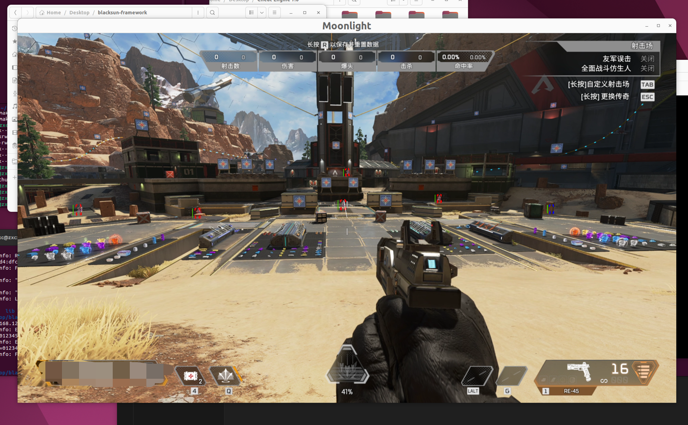

# blacksun framework for QEMU/KVM game cheat development

Already done

- Memory access and rendering both run outside the virtual machine, it is possible to bypass all anti-cheating detections, because cloud gaming service providers often use KVM.
- Modify Moonlight source code to render with imgui, compatible with vaapi(opengl), vdpau(sdlrender).
- Achieve ultra-low latency Moonlight game streaming with NAT network mode.
- Simulate keyboard and mouse input by sending SDL_Event to Moonlight.
- Simulate a mouse with a 100Hz polling rate to achieve more realistic aiming.
- Block side mouse button (the button that triggers aiming) inputs to the virtual machine to avoid some aim detection.

## Instructions:

Environment: Ubuntu 22.04.2 LTS

### Prepare

Ubuntu needs a cpu integrated graphics or a discrete graphics card to decode video for moonlight. In addition, another powerful graphics card is needed to passthrough directly into the KVM virtual machine to run games.

A laptop with a discrete graphics card can meet this requirement. Change the graphics device of the laptop to integrated graphics, and then connect the EDID Spoofer or a monitor to the HDMI port of the discrete graphics card to meet the requirements.

If you're using a desktop computer and the CPU's integrated graphics can work with a discrete graphics card, you'll need an EDID Spoofer. You should connect your monitor to the CPU's integrated graphics, and connect the EDID Spoofer to the discrete graphics card.

If you're using a desktop computer and your CPU doesn't have integrated graphics, you need to ensure that your computer motherboard has two PCIe x16 slots. You'll need an EDID Spoofer, a GT1030 graphics card, and make sure your power supply is sufficient. Take off the original graphics card from your computer, install the GT1030 into the first PCIe x16 slot on the motherboard, and place your original graphics card into the second PCIe x16 slot. This is done so that Ubuntu will treat the GT1030 as the Boot VGA device. Connect the monitor to the GT1030, and connect the EDID Spoofer to your original graphics card. Additionally, you need to install the NVIDIA graphics driver for Ubuntu.

### Installation

Install Ubuntu 22.04.2 LTS

Install the environment required for compiling and running

```bash
./setup-build-env.sh
```

Reboot

```bash
reboot
```

Disable Wayland 

```
sudo apt install -y vim
sudo vim /etc/gdm3/custom.conf

Uncomment #WaylandEnable=false in /etc/gdm3/custom.conf
```

Run the script to setup vfio-pci

```bash
cd gpu-passthrough
chmod +x *
sudo bash gpu_passthrough.sh
```

Reboot

```bash
reboot
```

Open virt-manager

Create a virtual machine named **win10**

Change the virtual network card to virtio mode, change the virtual disk to virtio mode, and add the discrete graphics card to the virtual machine

Install Windows10 21h2 in the virtual machine

Run Windows Update, manually download and install the graphics card driver

Install [Sunshine](https://github.com/LizardByte/Sunshine) in the virtual machine


### Compile

```bash
./build.sh
```

### Run

```bash
cd build/apex
./runcheat.sh
```

The cheat will launch a Moonlight client, use this to control the virtual machine

Download Apex and enjoy it.

## ToDoList

- [ ]  Study computer graphics and try to implement the ray tracing algorithm of the Unreal Engine externally.
- [ ]  Add the new feature of Ept breakpoint, implement Hook and CEServer.

## ScreenShots



[Aiming effect](https://streamvi.com/watch/1772658935995788)
